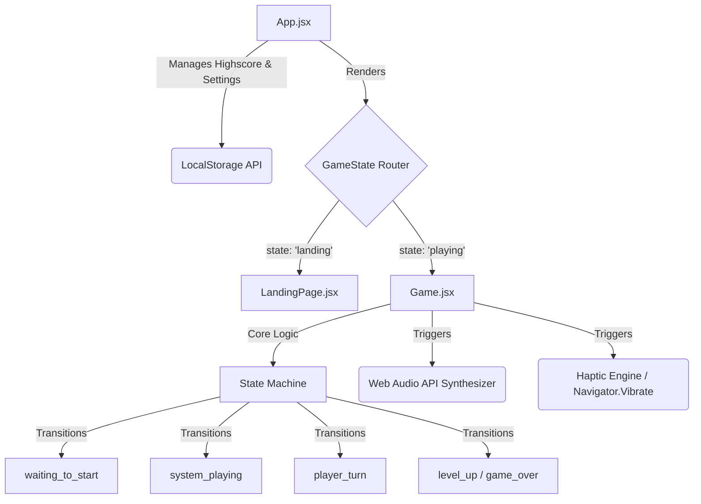

<div align="center">
  
  
  
</div>

<br />

<div align="center">
  <h1 align="center">PULSE</h1>
  <p align="center">
    <strong>A high-performance, mobile-optimized visual memory sequence application.</strong>
    <br />
    <br />
    <a href="https://github.com/Abhi666-max/pulse/issues">Report Issue</a>
    ·
    <a href="https://github.com/Abhi666-max/pulse/issues">Request Feature</a>
  </p>
</div>

<hr />

## Introduction

PULSE is a modernized, highly interactive iteration of the classic memory sequence genre. Developed with a primary focus on clean architecture, fluid micro-interactions, and hardware-accelerated rendering, the application challenges users to replicate increasingly complex sequences of visual and auditory stimuli. 

The user interface adheres to strict glassmorphism design principles, ensuring a distraction-free, immersive cognitive environment.

## System Architecture

The application is built on a robust, state-driven React architecture, utilizing Framer Motion for spring-physics animation and the native Web Audio API for zero-latency sound synthesis.



## Technical Implementation

### Key Features
- **Deterministic State Management:** A highly controlled React state machine prevents race conditions during asynchronous sequence playbacks.
- **Dynamic Audio Synthesis:** Rather than relying on static MP3 assets, the application utilizes the Web Audio API to generate delay-enveloped sine waves programmatically, significantly reducing the application bundle size.
- **Hardware-Accelerated Rendering:** Critical animations and background Gaussian blurs are explicitly delegated to the GPU using `transform: translateZ(0)` and `will-change: transform`, ensuring a consistent 60FPS across all mobile environments.
- **Persistent Storage:** Player preferences and high scores are serialized and maintained via the browser's `localStorage`.

### Project Structure

<details>
<summary>Click to expand file structure</summary>

```text
📦 pulse
 ┣ 📂 public/
 ┃ ┗ 📜 favicon.svg          
 ┣ 📂 src/
 ┃ ┣ 📂 components/
 ┃ ┃ ┣ 📜 Game.jsx           
 ┃ ┃ ┣ 📜 Game.css           
 ┃ ┃ ┣ 📜 LandingPage.jsx    
 ┃ ┃ ┣ 📜 LandingPage.css    
 ┃ ┃ ┣ 📜 SettingsModal.jsx  
 ┃ ┃ ┗ 📜 SettingsModal.css  
 ┃ ┣ 📂 utils/
 ┃ ┃ ┗ 📜 sound.js           
 ┃ ┣ 📜 App.jsx              
 ┃ ┣ 📜 App.css              
 ┃ ┗ 📜 main.jsx             
 ┣ 📜 index.html             
 ┣ 📜 package.json           
 ┗ 📜 README.md              
```
</details>

## Installation & Deployment

### Local Development

1. Clone the repository:
   ```bash
   git clone https://github.com/Abhi666-max/pulse.git
   ```
2. Navigate into the directory:
   ```bash
   cd pulse
   ```
3. Install dependencies:
   ```bash
   npm install
   ```
4. Start the Vite development server:
   ```bash
   npm run dev
   ```

### Production Build
To create an optimized production build:
```bash
npm run build
```
The output will be available in the `/dist` directory, ready for deployment on Vercel, Netlify, or any static hosting provider.

## Credits

Developed by **Abhijeet Kangane**
